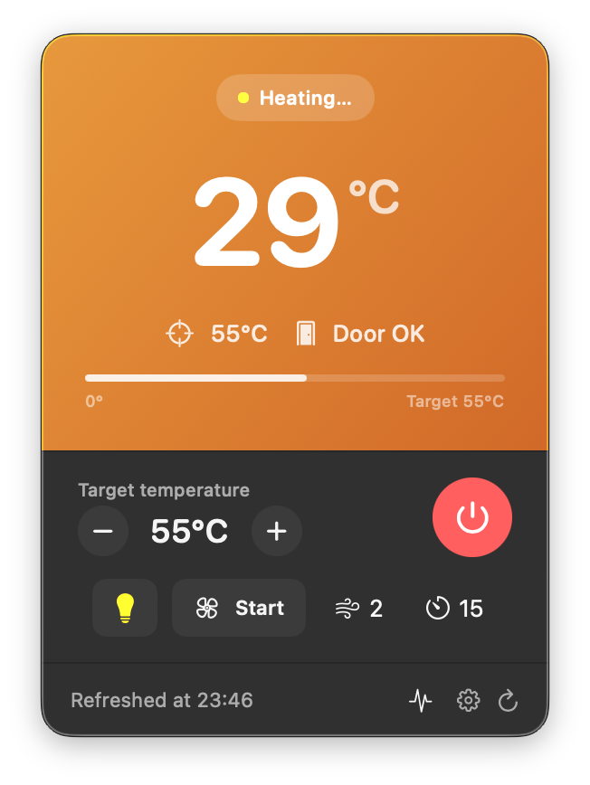

# SaunaBar

A tiny macOS menu bar app for monitoring and controlling a **Saunum** sauna heater
over Modbus TCP on your local network.

It lives in the menu bar, shows the current temperature at a glance, and lets you
turn the heater on/off, set a target temperature, toggle the light, and run the
fan — without opening the manufacturer's app or touching the wall panel.

<p align="center">
  
</p>

## Features

- **Live temperature** in the menu bar, with a status-colored icon (heating, ready, cooling, ventilating…).
- **One-click control**: power, target temperature, light, and fan speed/duration.
- **Auto-discovery**: scans your local subnet for a Saunum device on Modbus port 502, or enter the IP manually.
- **Ready notification**: a macOS notification fires when the sauna reaches your target temperature.
- **Diagnostics**: door state, active heater elements, device uptime, and controller alarms (thermal cutoff, door sensor, temperature sensor faults, etc.).
- **Bilingual UI**: Polish and English, switchable live from Settings (defaults to your system language).
- Native SwiftUI, runs as a background accessory app (no Dock icon).

## Requirements

- macOS 13 (Ventura) or later
- A Saunum sauna controller reachable over **Modbus TCP** on your local network
- Swift toolchain (Xcode or the Swift CLI) to build from source

## Build & run

```sh
git clone https://github.com/khasinski/saunabar.git
cd saunabar
make run        # build, (ad-hoc) sign, and launch
```

Available targets:

```sh
make run        # build, (ad-hoc) sign, and launch
make build      # build the release binary only
make install    # build + assemble SaunaBar.app + sign
make clean      # remove build artifacts
```

By default the app is **ad-hoc signed** so it builds and runs on any Mac without
an Apple Developer account. To produce a distributable, notarizable build, pass
your own Developer ID:

```sh
make install SIGN_IDENTITY="Developer ID Application: Your Name (TEAMID)"
```

On first launch, SaunaBar scans the local network for a Saunum device. Pick the
discovered device or enter its IP address manually. The chosen device is saved to
`~/.config/saunabar/config.json`.

## How it works

SaunaBar speaks raw **Modbus TCP** (function `0x03` read holding registers,
`0x06` write single register) directly over `Network.framework` — no third-party
dependencies. The register layout it expects:

| Action | Register(s) | Notes |
|--------|-------------|-------|
| Heater on/off | `0` (r/w) | `1` = on |
| Sauna type | `1` (r) | |
| Session duration | `2` (r) | minutes |
| Fan duration | `3` (r/w) | minutes |
| Target temperature | `4` (r/w) | °C |
| Fan speed | `5` (r/w) | `0`–`3` |
| Light on/off | `6` (r/w) | `1` = on |
| Current temperature | `100` (r) | °C |
| Device uptime | `101`–`102` (r) | 32-bit, seconds |
| Active heater elements | `103` (r) | |
| Door open | `104` (r) | non-zero = open |
| Alarms | `200`–`205` (r) | door/thermal/sensor flags |

Discovery probes port 502 on each host in the local `/24` and accepts a device
whose temperature/humidity registers report plausible values.

> This register map was reverse-engineered against a specific Saunum unit. Other
> models or firmware revisions may differ — adjust `SaunaMonitor.swift` and
> `ModbusClient.swift` if your device uses a different layout.

## Project layout

```
Sources/SaunaBar/
  App.swift            # menu bar entry point
  SaunaMonitor.swift   # state, polling, control logic, notifications
  ModbusClient.swift   # minimal Modbus TCP client
  SaunaDiscovery.swift # local-subnet device scan
  SaunaConfig.swift    # persisted device config
  SaunaView.swift      # main control popover
  DiscoveryView.swift  # first-run / discovery UI
  SettingsView.swift   # device + polling + language settings
  Localization.swift   # Polish/English string tables + language toggle
```

## Disclaimer

This is an unofficial, community project and is not affiliated with or endorsed
by Saunum. It controls heating equipment over the network — use it at your own
risk and never rely on it as a safety device.

## License

[MIT](LICENSE)
